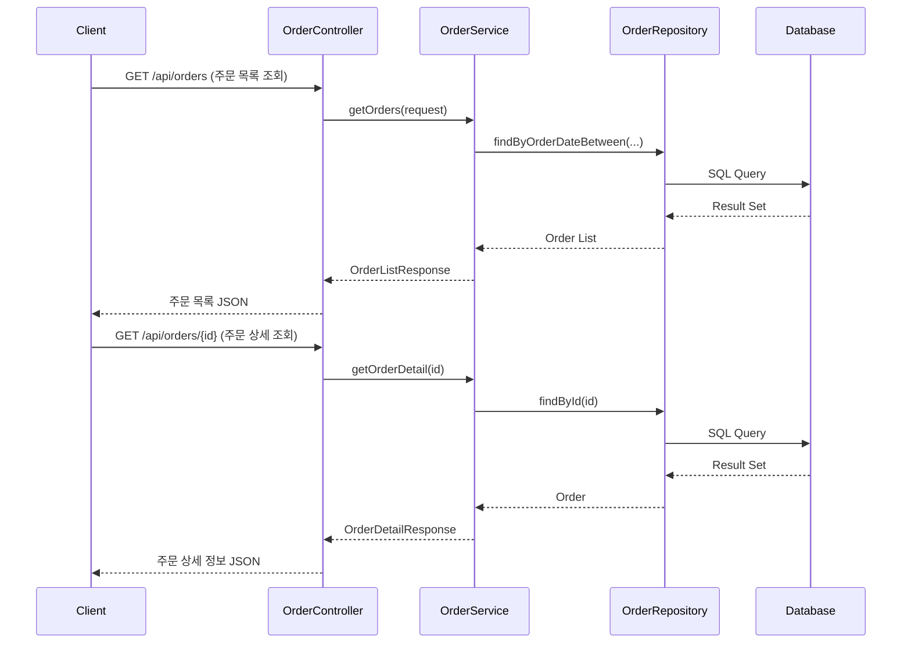

# 주문 API 명세서
> 주문 관련 API 명세서입니다. <br />
> 개발 참고 용도로 작성되었습니다.
## 공통 응답 구조

모든 API 응답은 다음 구조를 따릅니다:

```json
{
  "success": boolean,
  "data": object | null,
  "error": {
    "code": string,
    "message": string
  } | null
}
```

## 1. 주문 목록 조회

- **엔드포인트**: GET /api/orders
- **설명**: 주문 목록을 조회합니다. 다양한 필터링, 정렬, 페이징 옵션을 제공합니다.
- **요청 파라미터**:
    - `dateRange`: 조회 기간 (LAST_WEEK, LAST_MONTH, LAST_3_MONTHS, LAST_6_MONTHS, CUSTOM)
    - `startDate`: 시작 날짜 (dateRange가 CUSTOM일 때 필수)
    - `endDate`: 종료 날짜 (dateRange가 CUSTOM일 때 필수)
    - `status`: 주문 상태 (옵션)
    - `sortBy`: 정렬 기준 (RECENT, ORDER_STATUS, ALL)
    - `page`: 페이지 번호 (기본값: 0)
    - `size`: 페이지 크기 (기본값: 20)
- **응답**:
```json
{
  "success": true,
  "data": {
    "orders": [
      {
        "id": "ORDER123",
        "orderDate": "2024-06-28T10:30:00",
        "status": "COMPLETED",
        "totalAmount": 16200,
        "customerName": "홍길동"
      },
      // ... 더 많은 주문 객체들
    ],
    "totalElements": 1354,
    "totalPages": 68
  },
  "error": null
}
```

- **실패 응답 (400 Bad Request)**:

```json
{
  "success": false,
  "data": null,
  "error": {
    "code": "E001",
    "message": "Invalid input parameter: Page number cannot be negative"
  }
}
```
## 2. 주문 상세 조회

- **엔드포인트**: GET /api/orders/{id}
- **설명**: 특정 주문의 상세 정보를 조회합니다.
- **요청 파라미터**: id: 조회할 주문의 ID
- **성공 응답 (200 OK)**:
```json
{
  "success": true,
  "data": {
    "order": {
      "id": "ORDER123",
      "orderNumber": "Y0361995652",
      "orderDate": "2024-06-28T10:30:00",
      "status": "COMPLETED",
      "totalAmount": 16200,
      "customerName": "홍길동",
      "shippingAddress": "서울시 강남구 테헤란로 123",
      "paymentMethod": "신용카드"
    },
    "items": [
      {
        "productId": "BOOK123",
        "productName": "도서/문구: 은 공부 질대 미투지 마라",
        "quantity": 1,
        "price": 16200,
        "subtotal": 16200
      }
    ],
    "statusHistory": [
      {
        "status": "주문접수",
        "timestamp": "2024-06-28T10:30:00"
      },
      {
        "status": "결제완료",
        "timestamp": "2024-06-28T10:31:00"
      },
      {
        "status": "배송준비중",
        "timestamp": "2024-06-28T11:00:00"
      },
      {
        "status": "배송중",
        "timestamp": "2024-06-29T09:00:00"
      },
      {
        "status": "배송완료",
        "timestamp": "2024-06-30T14:00:00"
      }
    ]
  },
  "error": null
}
```


- **실패 응답 (404 Not Found)**:

```json
{
  "success": false,
  "data": null,
  "error": {
    "code": "E002",
    "message": "Order not found: ORDER123"
  }
}
```

# sequence-diagram
